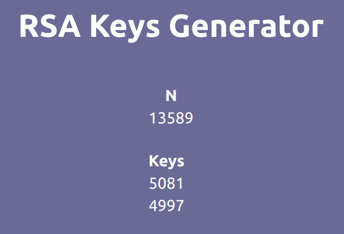

# RSA Public and Private Encryption Pair Generator 
## Keep trying to manually generate until you succeed 
## Very large calculations are halted so you may need to try several times
## Otherwise you can use the automatic generator

## And your encryption pairs will be good to go

## Now what do you do with these key pairs?
## They can be used to encrypt and decrypt data as follows: 
Say you have an unencrypted message as an integer number, say 4.  
Raise this number to the key E, say 5. So you get 1,024. This is your encrypted number.  
This can be decrypted by raising the encryoted number to D, say 11, and taking its modulus N.  
1,024 to the 11th power is 1.298074214634 e 33, and modulud 14 this is 4.  
In short:  
M^E = C mod(N) and C^D = M mod(N)  
Where M is the original message and C is the encrypted message, E is the public key and D is the private key.  
Try this modulus calculator online to test your encryption pairs: <a> https://www.mtholyoke.edu/courses/quenell/s2003/ma139/js/powermod.html </a> 

This application uses Node Package Manager. In the project directory command line you can run:   

### `npm i`  
And  
### `npm start`  
And make a static build with  
### `npm build`  
Or access all configuration files with  
### `npm eject`   

Notes: 
- The tsconfig.json file property "noImplicitAny" is false

