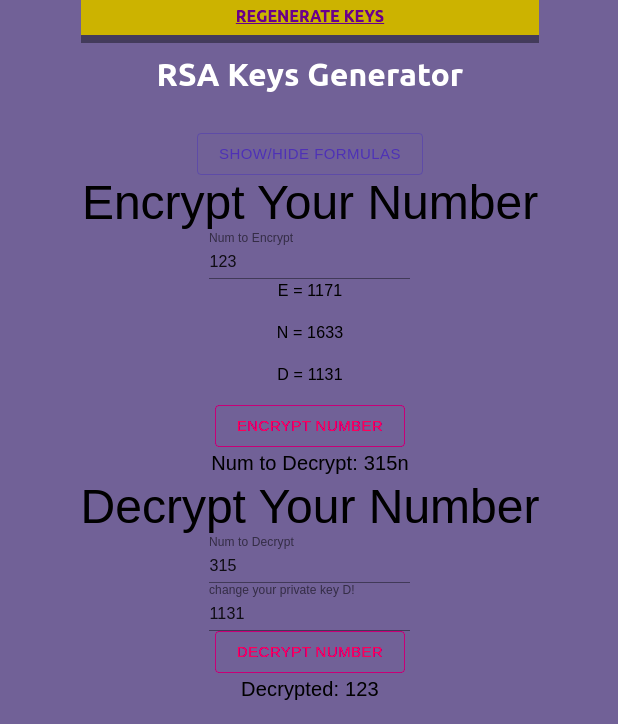

# RSA Public and Private Encryption Key Pair Generator
This TypsScript program will automatically generate pairs for you based on primes less than 149
Of course, you can increase the range of primes used but it will take up more computation time and energy. And your encryption pairs will be good to go



## Now what do you do with these key pairs? They can be used to encrypt and decrypt data as follows: 
Say you have an unencrypted message as an integer number, say 4. <br>
Raise this number to the key E, say 5. So you get 1,024. This is your encrypted number. <br>
This can be decrypted by raising the encryoted number to D, say 11, and taking its modulus N. <br>
1,024 to the 11th power is 1.298074214634 e 33, and modulus 14 this is 4. <br>
In short: <br>
M^E = C mod(N) and C^D = M mod(N) <br>
Where M is the original message and C is the encrypted message, E is the public key and D is the private key. Encrypted message must be at least 2 less than the modulo N or else it will break the algorithm. Likewise your encrypted message or integer cannot be equal to the larger prime or the larger prime + 1; otherwise your encrypted message will be your original message. <br>
Try this modulus calculator online to test your encryption pairs: <a> https://www.mtholyoke.edu/courses/quenell/s2003/ma139/js/powermod.html </a> or the nifty <a>https://www.emathcalculator.com/en/calculators/algebra/powerMod.php</a> <br>

TypeScript was used in this application, as well as a compiler target for ES2020. This was needed to use the BigInt data type to perform these large computations. Regular integers were just not enough. <br> 

### Live Mode Here: https://rsakeygen.herokuapp.com/ 

### Requirements 
* Node.js, NPM 

### Installation 
This application uses Node Package Manager. In the project directory command line you can run: <br> 

### `npm i` <br>
And <br>
### `npm start` <br>
And make a static build with <br>
### `npm build` <br>
Or access all configuration files with <br>
### `npm eject` <br> 

```Notes: ```
- The tsconfig.json file property "noImplicitAny" is false
- The tsconfig.json compilerOptions "target" is ES2020


